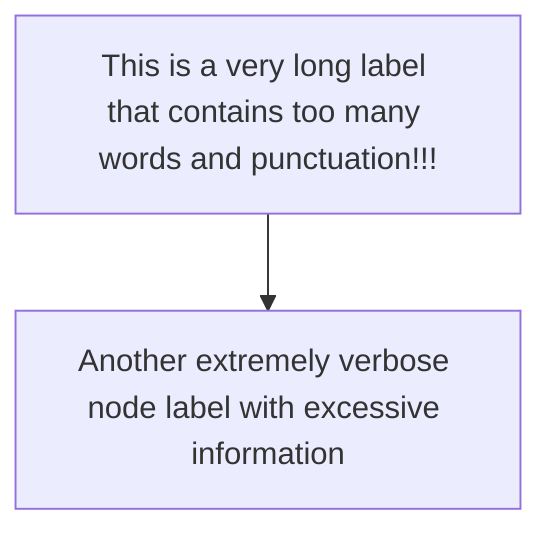
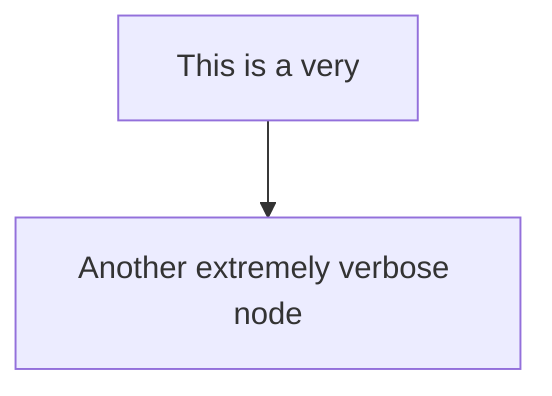

# SmartrVideoPlanner Scripts

Tools for generating educational video storyboards and diagrams.

## SmartrVideoPlanner

Generates JSON storyboard from lecture content.

### Usage

```bash
python scripts/smartr_video_planner.py input_template.json
```

Or pipe JSON:
```bash
echo '{"video_title":"...", "topic":"...", ...}' | python scripts/smartr_video_planner.py
```

### Input Format

```json
{
  "video_title": "Your Video Title",
  "topic": "Topic Name",
  "audience_level": "high_school" | "college",
  "summary_notes": "Lecture content summary...",
  "transcript_excerpt": "Transcript text (optional)..."
}
```

### Output

Returns JSON storyboard matching the required schema with 8-12 scenes, 60-120 seconds total duration.

---

## SmartrDiagramDesigner

Improves and corrects Mermaid code for educational diagrams.

### Usage

```bash
python scripts/smartr_diagram_designer.py flowchart "Learning goal" "graph TD\n    A[Very Long Label That Needs Shortening]\n    A --> B[End]"
```

Or with JSON:
```bash
echo '{"diagram_type":"flowchart","learning_goal":"...","mermaid_code":"..."}' | python scripts/smartr_diagram_designer.py
```

### Input Format

JSON with:
- `diagram_type`: "flowchart" | "timeline" | "sequence" | "concept_map"
- `learning_goal`: String describing the learning goal
- `mermaid_code`: Current Mermaid code to improve

### Output

Returns **ONLY** cleaned Mermaid code (no markdown, no commentary).

### Features

- Shortens labels to max 3-5 words per node
- Removes excessive punctuation
- Validates and fixes Mermaid syntax
- Ensures proper diagram type declaration
- Formats code for readability

### Example

**Input:**


**Output:**


---

## SmartrIllustrationPrompt

Generates clean image generation prompts for educational illustrations following STYLE_ANCHOR guidelines.

### Usage

```bash
python scripts/smartr_illustration_prompt.py "Learning goal" "Visual description"
```

Or with JSON:
```bash
echo '{"learning_goal":"...","image_description":"..."}' | python scripts/smartr_illustration_prompt.py
```

### Input Format

- `learning_goal`: String describing the scene's learning objective
- `image_description`: String describing the visual content needed

Or as JSON:
```json
{
  "learning_goal": "Understand the process flow",
  "image_description": "A simple flowchart showing three steps"
}
```

### Output

Returns **ONLY** the cleaned image generation prompt (no markdown, no commentary).

### Features

- Applies STYLE_ANCHOR guidelines strictly
- Ensures no text, logos, brands, watermarks, or emojis
- Neutral grey subtle gradient background
- Modern flat vector style
- Centered composition with negative space
- Bottom space reserved for captions
- Professional educational aesthetic

### Example

**Input:**
- Learning goal: "Understand photosynthesis process"
- Image description: "A plant cell showing chloroplasts and sunlight conversion"

**Output:**
```
A plant cell showing chloroplasts and sunlight conversion, premium educational illustration, modern flat vector style, neutral grey subtle gradient background, subject centered with generous negative space, empty space reserved at bottom for captions, minimal clutter, high readability, simple clean shapes, medium-wide stable camera framing, classroom explainer video style. Do not include: no text, no words or letters, no logos or brands, no watermarks, no emojis, no complex details, no busy patterns.
```

---

## SmartrVeoDirector

Converts storyboard JSON into Veo job specifications for video generation with audio.

### Usage

```bash
python scripts/smartr_veo_director.py storyboard.json
```

Or pipe JSON:
```bash
echo '<storyboard_json>' | python scripts/smartr_veo_director.py
```

### Input Format

JSON storyboard matching the SmartrVideoPlanner output schema:
```json
{
  "video_title": "...",
  "topic": "...",
  "audience_level": "high_school",
  "total_duration_seconds": 90,
  "global_visual_style": {...},
  "scenes": [
    {
      "scene_id": 1,
      "duration_seconds": 8,
      "learning_goal": "...",
      "narration_text": "...",
      "on_screen_text": [...],
      "visual_type": "diagram" | "chart" | "illustration",
      "diagram_spec": {...},
      "image_spec": {...},
      "veo_motion_hint": {
        "camera": "static" | "slow_zoom" | "pan" | "push_in" | "pull_out",
        "emphasis": "...",
        "motion_style": "..."
      }
    }
  ]
}
```

### Output

Returns **strict JSON only** (no markdown, no commentary) with Veo job specifications:

```json
{
  "audio_policy": {
    "audio_source": "veo_only",
    "narration_style": "clear teacher voice, calm pace, neutral accent",
    "ambient_style": "subtle, very low volume, not distracting",
    "music_policy": "no music if it reduces clarity"
  },
  "veo_jobs": [
    {
      "scene_id": 1,
      "clip_duration_seconds": 8,
      "input_type": "image_to_video",
      "visual_prompt": "...",
      "negative_prompt": "...",
      "audio_prompt": "..."
    }
  ]
}
```

### Features

- Generates visual prompts with calm educational motion
- Includes camera behavior from `veo_motion_hint`
- Creates audio prompts with exact narration text
- Adds negative prompts following STYLE_ANCHOR
- Forbids text, logos, watermarks, emojis
- Prevents cinematic/dramatic effects
- Ensures classroom explainer style pacing

### Visual Prompt Rules

- Describes calm educational motion
- Includes camera behavior (slow zoom/pan/push/pull)
- Specifies what to emphasize
- Applies STYLE_ANCHOR guidelines
- Neutral grey background, flat vector style

### Audio Prompt Rules

- Instructs Veo to speak exact `narration_text`
- Requests subtle ambient bed
- Forbids distracting SFX
- Clear teacher voice, calm pace
- No music that reduces clarity

### Negative Prompt Rules

- Forbids on-screen text, subtitles, logos, watermarks, emojis
- Prevents cinematic/dramatic effects
- No shaky camera, fast cuts, busy backgrounds
- No new objects that change meaning
- Avoids TikTok-style fast motion

---

## SmartrImageAnimator

Generates animation prompts for reference images to create short educational clips. Follows STYLE_ANCHOR guidelines.

### Usage

```bash
python scripts/smartr_image_animator.py "calm educational pacing" "slow_zoom" "content clarity"
```

Or with JSON:
```bash
echo '{"motion_style":"...","camera":"...","emphasis":"..."}' | python scripts/smartr_image_animator.py
```

### Input Format

- `motion_style`: String describing the motion style (e.g., "calm educational pacing")
- `camera`: Camera behavior (e.g., "static", "slow_zoom", "pan", "push_in", "pull_out")
- `emphasis`: What to emphasize or guide attention to

Or as JSON:
```json
{
  "motion_style": "calm educational pacing",
  "camera": "slow_zoom",
  "emphasis": "content clarity"
}
```

### Output

Returns **strict JSON only** with animation and negative prompts:

```json
{
  "animation_prompt": "Animate with calm educational pacing, very slow gentle zoom in, smooth and steady, subtle highlight movement to guide attention to content clarity, calm classroom pacing, ...",
  "negative_prompt": "no text in video, no words or letters, no new objects, ..."
}
```

### Features

- Generates animation prompts for reference images
- Follows STYLE_ANCHOR guidelines strictly
- Ensures calm classroom pacing
- Creates subtle highlight movement to guide attention
- Prevents introduction of new objects
- Keeps background consistent and clean
- No text generation

### Animation Rules

- Calm classroom pacing (not cinematic, not TikTok)
- Subtle highlight movement to guide attention
- Do NOT introduce new objects that change meaning
- No text generation
- Keep the background consistent and clean
- Smooth gentle motion only
- Maintain exact composition from reference
- Guide viewer attention through subtle motion

### Supported Camera Behaviors

- `static`: Static stable camera, no movement
- `slow_zoom`: Very slow gentle zoom in, smooth and steady
- `pan`: Slow smooth pan, steady and controlled
- `push_in`: Gentle slow push in, smooth camera movement
- `pull_out`: Gentle slow pull out, smooth camera movement
- `slight_tilt`: Very subtle tilt, barely noticeable
- `static_with_focus`: Static camera with subtle focus adjustment

### Example

**Input:**
- Motion style: "calm educational pacing"
- Camera: "slow_zoom"
- Emphasis: "the main concept in the center"

**Output:**
```json
{
  "animation_prompt": "Animate with calm educational pacing, very slow gentle zoom in, smooth and steady, subtle highlight movement to guide attention to the main concept in the center, calm classroom pacing, premium educational motion graphics style, neutral grey subtle gradient background stays consistent, background remains clean and unchanged, keep all existing elements in the reference image, do not introduce new objects that change meaning, maintain the exact composition from the reference, smooth gentle motion only, no dramatic movements or effects, no text generation in the video, no words, letters, or text appear, professional educational explainer style, movement should be minimal and purposeful, guide viewer attention through subtle motion, preserve the educational clarity of the reference, maintain visual consistency throughout, smooth transitions without distractions.",
  "negative_prompt": "no text in video, no words or letters, no new objects, no elements not in reference image, no logos or brand names, no watermarks, no emojis or symbols, no dramatic camera movements, no shaky camera, no fast motion, no cinematic effects, no busy animations, no distracting movements, no changes to background, no introduction of new colors, no elements that change meaning, avoid busy patterns, no complex details added, no decorative elements, no TikTok-style fast cuts."
}
```

---

## SmartrAudioGenerator

Generates audio specifications for educational video clips with teacher narration and ambient sound.

### Usage

```bash
python scripts/smartr_audio_generator.py "Your narration text here"
```

Or with JSON:
```bash
echo '{"narration_text":"Your narration text here"}' | python scripts/smartr_audio_generator.py
```

Or pipe plain text:
```bash
echo "Your narration text here" | python scripts/smartr_audio_generator.py
```

### Input Format

- `narration_text`: String containing the exact text to be spoken

Or as JSON:
```json
{
  "narration_text": "Photosynthesis is the process by which plants convert sunlight into energy."
}
```

### Output

Returns **strict JSON only** with complete audio specification:

```json
{
  "audio_source": "veo_only",
  "narration_style": "clear teacher voice, calm pace, neutral accent",
  "narration_text": "Photosynthesis is the process...",
  "audio_prompt": "Speak clearly and naturally, reading EXACTLY: 'Photosynthesis is the process...', use clear teacher voice, calm measured pace, neutral accent, professional educational narration style, add subtle very low volume ambient background sound bed, ambient should be continuous and not distracting, if narration ends before clip duration, continue ambient sound only, no silence gaps, no sound effects, no music that reduces clarity, maintain consistent audio level throughout, educational classroom audio style.",
  "negative_audio_prompt": "no music, no sound effects, no distracting background sounds, no loud ambient, no background conversations, no environmental noise, no silence gaps, no abrupt audio cuts, no volume fluctuations, no echo or reverb effects.",
  "ambient_style": "subtle, very low volume, continuous, not distracting",
  "music_policy": "no music if it reduces clarity",
  "sfx_policy": "no distracting sound effects",
  "silence_policy": "no silence gaps; continue ambient if narration ends early",
  "audio_requirements": [
    "Spoken teacher narration reading EXACTLY the provided text",
    "Clear, calm, neutral accent",
    "Subtle ambient sound bed at very low volume",
    "No music if it reduces clarity",
    "No distracting sound effects",
    "No silence gaps - ambient continues if narration ends early"
  ]
}
```

### Features

- Generates audio prompts with exact narration text
- Specifies clear teacher voice, calm pace, neutral accent
- Requests subtle ambient sound bed at very low volume
- Ensures no silence gaps (ambient continues if narration ends early)
- Prevents music that reduces clarity
- Forbids distracting sound effects
- Maintains consistent audio level
- Professional educational classroom style

### Audio Requirements

- **Narration**: Spoken teacher narration reading EXACTLY the provided text
- **Voice**: Clear, calm, neutral accent
- **Ambient**: Subtle sound bed at very low volume, continuous
- **Music**: No music if it reduces clarity
- **SFX**: No distracting sound effects
- **Silence**: No silence gaps; ambient continues if narration ends early

### Example

**Input:**
```
"Photosynthesis is the process by which plants convert sunlight into energy through chloroplasts."
```

**Output:**
Complete JSON audio specification with:
- Exact narration text preserved
- Audio prompt for Veo or similar services
- Negative audio prompt to prevent unwanted sounds
- All policies and requirements clearly specified

---

## SmartrNegativePrompt

Generates standardized negative prompts for educational video generation following STYLE_ANCHOR rules.

### Usage

```bash
python scripts/smartr_negative_prompt.py
```

Or with JSON for customization:
```bash
echo '{"include_standard":true,"additional_rules":["no music"]}' | python scripts/smartr_negative_prompt.py
```

### Output

Returns **ONLY** the negative prompt text (no markdown, no commentary):

```
no on-screen text, no subtitles burned in, no logos, no brand names, no watermarks, no emojis, no dramatic cinematic effects, no shaky cam, no fast cuts, no busy backgrounds, do not add objects that change the concept.
```

### Standard Rules

The tool enforces these standard negative prompt rules:

- No on-screen text
- No subtitles burned in
- No logos
- No brand names
- No watermarks
- No emojis
- No dramatic cinematic effects
- No shaky cam
- No fast cuts
- No busy backgrounds
- Do not add objects that change the concept

### Features

- Generates standardized negative prompts
- Ensures consistency across all video generation tools
- Can include additional custom rules
- Removes duplicates automatically
- Used by other Smartr tools for consistency

### Integration

This tool's rules are also available as `style_constants.py` for import by other tools, ensuring all tools use the same negative prompt standards.
