# Feature Pipelines

One flowchart per feature. Linear steps, one decision where needed.

---

## Lesson Hub (entry and actions)

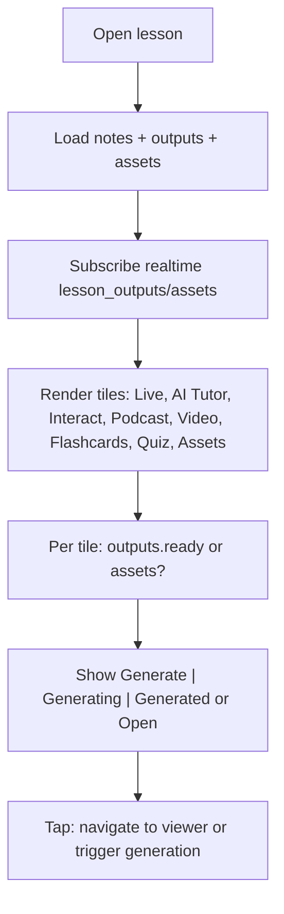

---

## Notes

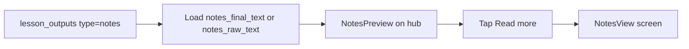

---

## Notes generation (append and finalize)

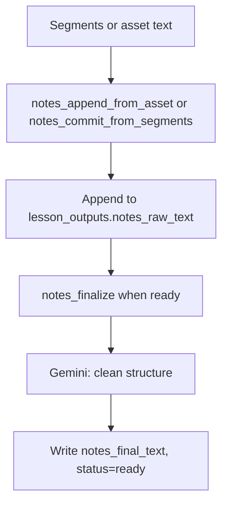

---

## Live (record and translate)

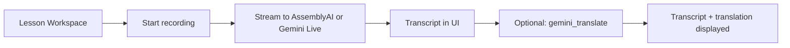

---

## AI Tutor

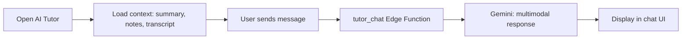

---

## Interact (interactive solver)

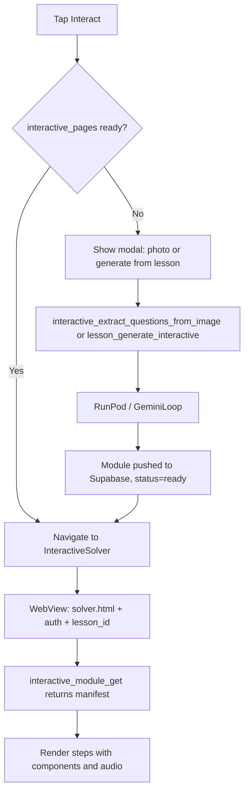

---

## Podcast

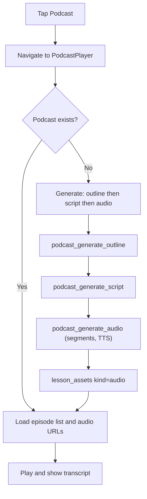

---

## Video

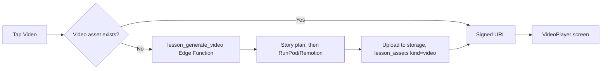

---

## Flashcards

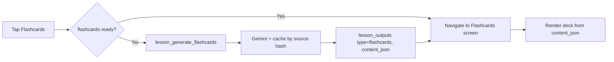

---

## Quiz

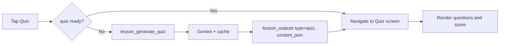

---

## Assets

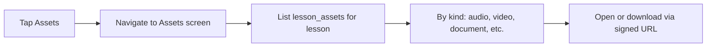

---

## YouTube recommendations

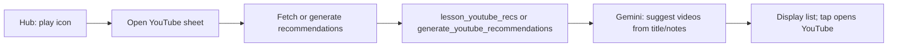

---

## Schedules

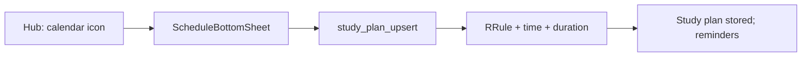
